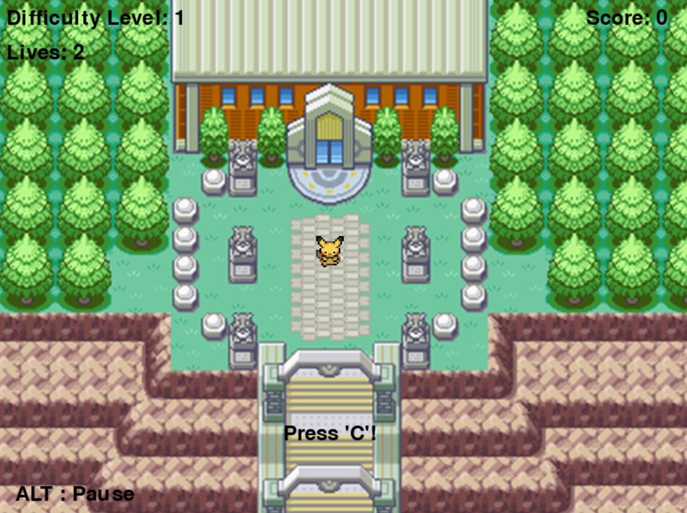

# Jeu QTE - README

## Description

Ce projet est un jeu de type Quick Time Event (QTE) réalisé en Python, en utilisant le module `pygame`. Le jeu est conçu selon l'architecture MVC (Modèle-Vue-Contrôleur) pour mieux structurer le code et faciliter les modifications ou ajouts de fonctionnalités. 

Le joueur doit réussir des actions rapides (QTE) pour marquer des points, avec des niveaux de difficulté croissants. Le jeu utilise un écran, des animations, et peut se connecter à un module ESP32 pour les entrées physiques, augmentant l’interactivité.



Vidéo de Gameplay : https://youtube.com/shorts/vX9Amti7ccY  
Vidéo de visualisation des données : https://youtu.be/N4BVslGMSX4

## Structure des fichiers

### Arborescence des fichiers
```
.
├── main.py                   # Point d'entrée principal du jeu
├── controller/
│   ├── game_controller.py    # Contrôleur du jeu
│   └── menu_controller.py    # Contrôleur du menu
├── model/
│   └── qte_event.py          # Modèle d'événements QTE
├── view/
│   ├── renderer.py           # Classe de rendu graphique
│   └── spritesheet.py        # Utilitaire pour la gestion de sprites
├── assets/
│   ├── images/               # Dossier des images (background, sprites, etc.)
│   ├── musics/               # Musique et sons du jeu
│   └── scores.csv            # Fichier CSV pour sauvegarder les scores
├── analysis/
│   └── user_behavior.py      # Script pour analyser les scores des joueurs avec des graphiques
│   └── user_behavior.ipynb   # Notebook pour analyser les scores des joueurs avec des graphiques
├── esp_game/
│   └──esp_game.ino           # Code Arduino pour l'ESP32 pour la prise en charge des entrées
```
Certains fichiers ont été omis afin de simplifier l'arborescence.

## Explication des Fichiers

### 1. `main.py`

**Fonctionnalité :**
Ce fichier est le point d'entrée de l'application. Il initialise `pygame` et gère la logique de navigation entre le menu et le jeu.

**Contenu principal :**
- Initialisation de `pygame`.
- Création d’une instance de `MenuController` pour afficher le menu.
- Navigation entre les différentes options (jouer, afficher les scores, quitter).
- Démarrage du jeu via le `GameController`.

### 2. `controller/game_controller.py`

**Fonctionnalité :**
Gère la logique du jeu, y compris le système QTE, le contrôle de la difficulté, la gestion des vies et le score.

**Contenu principal :**
- Initialisation des éléments graphiques et de la connexion série avec l'ESP32.
- Gestion des événements QTE et des entrées série.
- Augmentation de la difficulté au fil du temps.
- Enregistrement des scores dans un fichier CSV.
- Gestion de l'animation de réussite et de défaite.
- Utilisation de `Renderer` pour gérer l’affichage des éléments de jeu.

### 3. `controller/menu_controller.py`

**Fonctionnalité :**
Contrôle le menu principal, le choix du pseudo, et l'affichage des scores.

**Contenu principal :**
- Gestion des options du menu (lancer le jeu, afficher les scores, quitter).
- Gestion des entrées clavier pour naviguer dans le menu.
- Saisie du pseudo du joueur.
- Gestion des scores à partir du fichier CSV.

### 4. `model/qte_event.py`

**Fonctionnalité :**
Modélise un événement QTE. Il génère un QTE aléatoire et vérifie la validité des entrées de l’utilisateur pour réussir ou échouer.

**Contenu principal :**
- Génération d'un QTE avec une durée spécifique.
- Vérification de l'entrée utilisateur.
- Gestion du statut (actif, réussi, ou échoué) du QTE.

### 5. `view/renderer.py`

**Fonctionnalité :**
Gère l'affichage visuel du jeu, y compris les animations et les éléments textuels.

**Contenu principal :**
- Chargement des sprites depuis une feuille de sprites (`spritesheet`).
- Gestion des animations (normal, réussite de QTE).
- Affichage des informations de jeu comme le score, le niveau de difficulté, les vies.
- Affichage des animations de succès ou d'échec de QTE.

### 6. `view/spritesheet.py`

**Fonctionnalité :**
Classe utilitaire pour extraire et gérer des sprites à partir d’une image de spritesheet.

**Contenu principal :**
- Découpe d'une image en plusieurs sprites en fonction des dimensions et de la position.
- Utilisé par `Renderer` pour gérer les animations du joueur.

### 7. `esp_game.ino`

**Fonctionnalité :**
Code Arduino pour l'ESP32 permettant de lire des entrées physiques sur un keypad et d’envoyer les données via la connexion série.

**Contenu principal :**
- Configuration d'un keypad de 3x3.
- Lecture des touches appuyées et envoi des informations via la liaison série.
- Prend en charge plusieurs touches pour interagir avec le jeu.

### 8. `user_behavior.py`

**Fonctionnalité :**
Script d'analyse pour lire les scores sauvegardés dans `assets/scores.csv` et générer des graphiques pour observer les performances des joueurs.

**Contenu principal :**
- Chargement des scores depuis le fichier CSV.
- Génération de graphiques (barres, lignes, points) pour visualiser les scores ou les temps de jeu.
- Analyse des scores pour en apprendre plus sur la difficulté du jeu et les performances des joueurs.

## Utilisation

### Pré-requis

1. **Python 3** - Assurez-vous que Python 3 est installé.
2. **Pygame** - Installez `pygame` via `pip install pygame`.
3. **Bibliothèque Série** - Pour l'intégration ESP32, assurez-vous que la bibliothèque `pyserial` est installée avec `pip install pyserial`.
4. **ESP32 et Arduino IDE** - Nécessaire pour téléverser le code `esp_game.ino` sur votre ESP32.

### Installation

1. Clonez le dépôt.
2. Placez les fichiers nécessaires dans les dossiers respectifs.
3. Assurez-vous que les dossiers `assets/images/` et `assets/musics/` contiennent les images et musiques nécessaires (ex: `background.png` et `champion_red_battle.mp3`).

### Démarrage du Jeu

1. **Exécutez `main.py` :**
   ```bash
   python main.py
   ```
2. **Menu Principal :** Utilisez les options du menu pour démarrer le jeu, voir les scores, ou quitter.

### Utilisation de l'ESP32

1. **Téléversez `esp_game.ino`** sur votre ESP32 via l'IDE Arduino.
2. Connectez l'ESP32 au port série (ex: `COM6` sous Windows).
3. Dans `main.py`, assurez-vous de spécifier le port série utilisé par votre ESP32 lors de l'initialisation du `GameController`.

### Analyser les Scores avec `user_behavior.py`

1. Exécutez `user_behavior.py` pour afficher les scores et les temps de jeu des joueurs sous forme de graphiques.
   ```bash
   python user_behavior.py
   ```
2. Entrez des commandes comme :
   - `score 1` pour afficher les scores sous forme de graphique à barres.
   - `temps 2` pour afficher le temps de jeu sous forme de graphique en lignes.

### Commandes de Jeu

- **QTE:** Appuyez sur la touche correspondant à l'action demandée dans le QTE.
- **Pause:** Appuyez sur ALT pour mettre en pause.
- **Menu:** En appuyant sur Échap, vous revenez au menu depuis les sections.

## Notes

- **Fichier `scores.csv` :** Ce fichier enregistre les scores des joueurs avec le pseudo, le score, le niveau de difficulté atteint, et le temps de jeu total.
- **Configuration du clavier de l'ESP32 :** Les touches du clavier sont préconfigurées (ex: `U`, `D`, `L`, `R`, `A`, `B`, `9`) pour déclencher des actions spécifiques dans le jeu. Assurez-vous que votre clavier est câblé correctement et que les broches sont configurées pour correspondre à `esp_game.ino`.

## Prochaines Améliorations

1. **Ajout d'un mode multijoueur** pour jouer à plusieurs via un réseau local.
2. **Optimisation des animations** pour des performances plus fluides sur différents appareils.
3. **Options de personnalisation** des niveaux de difficulté et de la musique.